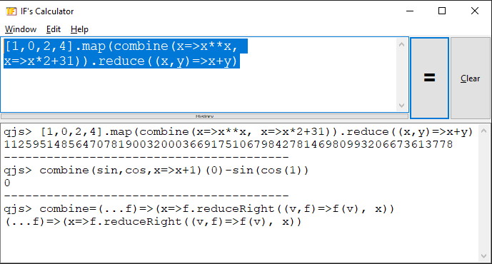

# ICIC

ICIC reads _I see, I see_

ICIC is a comfortable ergonomic calculator with [QuickJS](https://bellard.org/quickjs/) and [Lua](https://lua.org/) at its core, and a minimal old-school GUI:

## Features

* Lightweight, standalone, single executable
* Instant startup
* Fully keyboard driven
* Big integers, fractions, arbitrary precision floating point operations, powered by QuickJS
* No bullshit

## Shortcuts

|             |                      |
| ------------|----------------------|
| Ctrl+Enter  | Compute              |
| Ctrl+L      | Clear                |
| Ctrl+N      | New Window           |
| Ctrl+Q      | Quit                 |
| Ctrl+T      | Toggle Stay On Top   |
| Alt+Shift+J | Use QuickJS          |
| Alt+Shift+L | Use Lua              |

## Why Yet Another Calculator

There are many calculators with decent graphical UIs out there, but one curious thing I found is that scripting language REPLs like python / lua / quickjs ... are generally much more confortable to use as a calculator.

Yet having a graphical interface is still preferable for me, for several reasons:

* Editing expression with a full featured text edit control feels better than edit it in console, especially when the expression spans over multiple lines 
* Copying / pasting things from / to other applications is easier
* Sometimes I want a calculator to stay on top of other windows
* Jupyter notebook is really really good, just too heavy

So I made this. 
